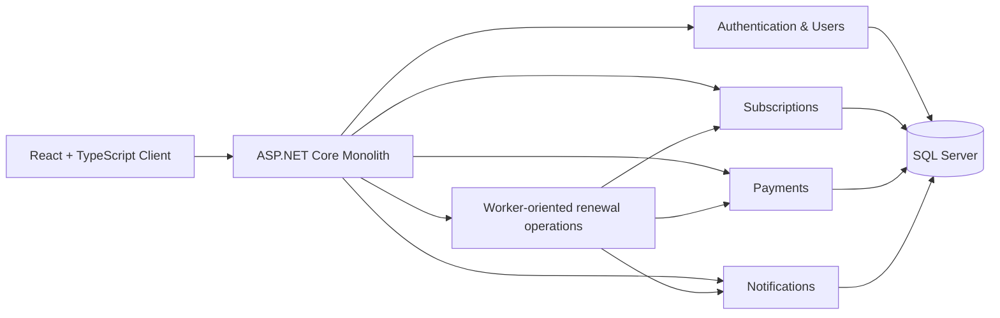
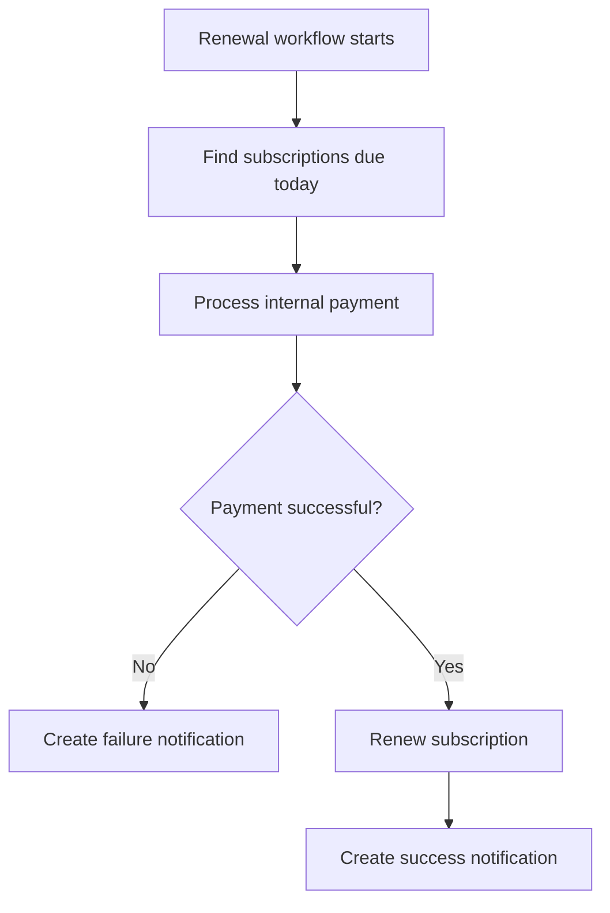
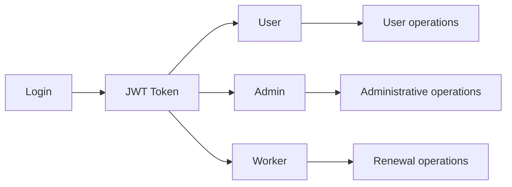

# 🚀 SubTrack

> **A full-stack subscription management platform for tracking subscriptions, recurring billing, payments, notifications, and role-based access control.**

SubTrack is a full-stack portfolio project built with **React + TypeScript** on the frontend and a **single ASP.NET Core monolithic backend**. The application brings authentication, user management, subscriptions, payments, and notifications together in one deployable backend while keeping feature responsibilities separated internally.

<p align="center">
  
  
  
  
  
</p>

---

## ✨ Why SubTrack?

SubTrack goes beyond basic CRUD by combining **authentication, authorization, subscription lifecycle management, payment processing, notifications, and recurring-billing workflows** into one application.

### Key characteristics

- 🔐 **JWT authentication + role-based authorization** for `User`, `Admin`, and `Worker`
- 🧩 **Monolithic ASP.NET Core backend** organized by feature responsibility
- 💳 **Payment processing** for subscription transactions
- 🔔 **Notification workflow** for subscription and payment outcomes
- 🗄️ **Entity Framework Core + SQL Server** persistence
- 🔄 **EF Core migrations** for database schema evolution
- ⚛️ **React + TypeScript frontend** with dedicated API service modules
- 🧪 **Postman-based API testing** support

> **Architecture note:** This branch represents the **monolithic architecture**. Authentication, subscriptions, payments, notifications, and worker-oriented operations run inside the same ASP.NET Core application rather than separate deployable services.

---

## 🏗️ Architecture

The application has two primary runtime parts: a React client and a single ASP.NET Core backend.



### Internal feature responsibilities

| Feature | Responsibility |
|---|---|
| **Authentication & Users** | Registration, login, JWT authentication, profiles, passwords, and user/role administration |
| **Subscriptions** | Subscription CRUD, lifecycle/status management, categories, due-subscription detection, and renewal operations |
| **Payments** | Payment processing, payment lookup, and transaction history |
| **Notifications** | User notifications, unread counts, read/unread management, and administrative notification operations |
| **Worker operations** | Role-protected operations used for recurring renewal workflows; these are part of the same backend process |

---

## 🔄 Subscription Renewal Workflow

The monolithic backend contains the endpoints and service logic required for recurring subscription processing. Worker-authorized operations can identify subscriptions due for renewal, process an internal payment, renew the subscription, and create a notification for the outcome.



The current branch does **not** contain a separate deployable Renewal Worker service. Worker-specific behavior is exposed through role-protected endpoints inside the monolithic ASP.NET Core application.

---

## 🔐 Authentication & Authorization

SubTrack uses **JWT authentication** together with **role-based authorization**.



### Roles

| Role | Typical responsibilities |
|---|---|
| **User** | Manage profile, subscriptions, payments, and notifications |
| **Admin** | Manage users/roles and access system-wide administrative data |
| **Worker** | Execute protected renewal, payment, and notification operations |

---

## 💡 Key Features

### Authentication & User Management

- User registration and login
- JWT-based authentication
- User profile retrieval and updates
- Password changes
- Admin user listing
- Admin role management

### Subscription Management

- Create and update subscriptions
- View individual subscriptions
- View the authenticated user's subscriptions
- Admin access to all subscriptions
- `Active`, `Paused`, and `Cancelled` statuses
- Monthly and yearly billing cycles
- Subscription categories
- Next billing date tracking
- Due-subscription detection
- Protected renewal operations
- Admin subscription deletion

### Payments

- User-initiated payment processing
- Worker-only internal payment processing
- Payment lookup by ID
- Payment history by subscription
- User transaction history
- Admin access to all payments

### Notifications

- Protected notification creation for workflow operations
- View current user's notifications
- Unread notification count
- Mark individual notifications as read
- Mark all notifications as read
- Admin notification management

---

## 📡 API Reference

The current backend exposes **34 controller routes/actions** across authentication, users, subscriptions, payments, and notifications.

<details>
<summary><strong>View API endpoints</strong></summary>

### Authentication — `/auth`

| Method | Endpoint | Access | Purpose |
|---|---|---|---|
| POST | `/auth/register` | Public | Register a new user |
| POST | `/auth/login` | Public | Authenticate a user |

### User Management — `/user`

| Method | Endpoint | Access | Purpose |
|---|---|---|---|
| GET | `/user/profile` | Authenticated | Get authenticated user's profile |
| PATCH | `/user/update` | Authenticated | Update authenticated user's profile |
| PATCH | `/user/changepassword` | Authenticated | Change authenticated user's password |
| GET | `/user/alluser` | Admin | List users |
| PATCH | `/user/role/{userId}/{role}` | Admin | Update a user's role |

### Subscriptions — `/subscription`

| Method | Endpoint | Access | Purpose |
|---|---|---|---|
| POST | `/subscription/create` | Authenticated | Create a subscription |
| PATCH | `/subscription/update/{subscriptionid}` | Authenticated | Update a subscription |
| GET | `/subscription/all` | Admin | List all subscriptions |
| GET | `/subscription/{subscriptionid}` | Authenticated | Get a subscription by ID |
| GET | `/subscription/user-subscription` | Authenticated | Get current user's subscriptions |
| PUT | `/subscription/status/{subscriptionid}/{status}` | Authenticated | Update subscription status |
| DELETE | `/subscription/{subscriptionid}` | Admin | Delete a subscription |
| PATCH | `/subscription/renew/{subscriptionid}` | Worker | Renew a subscription |
| GET | `/subscription/due` | Worker/Admin | Get subscriptions due for renewal |
| GET | `/subscription/categories` | Authenticated | Get available categories |

### Payments — `/payment`

| Method | Endpoint | Access | Purpose |
|---|---|---|---|
| POST | `/payment/process` | Authenticated | Process a user payment |
| POST | `/payment/processinternal` | Worker | Process an internal payment |
| GET | `/payment/{paymentid}` | Authenticated | Get a payment by ID |
| GET | `/payment/subscription/{subscriptionId}` | Authenticated | Get payments for a subscription |
| GET | `/payment/transactions` | Authenticated | Get user's transaction history |
| GET | `/payment/all` | Admin | List all payments |

### Notifications — `/notification`

| Method | Endpoint | Access | Purpose |
|---|---|---|---|
| POST | `/notification/create` | Worker | Create a notification |
| GET | `/notification/my` | Authenticated | Get current user's notifications |
| PATCH | `/notification/readall` | Authenticated | Mark all notifications as read |
| PATCH | `/notification/read/{notificationId}` | Authenticated | Mark a notification as read |
| GET | `/notification/unreadcount` | Authenticated | Get unread notification count |
| DELETE | `/notification/delete/{notificationId}` | Admin | Delete a notification |
| GET | `/notification/all` | Admin | List all notifications |

</details>

> The exact request/response DTOs and validation rules are defined in the backend source under `Server/Server/Dto` and the corresponding services/controllers.

---

## 🧰 Tech Stack

### Backend

- **C# / ASP.NET Core .NET 10**
- **Entity Framework Core 10**
- **ASP.NET Identity**
- **JWT Authentication**
- **Role-Based Authorization**
- **SQL Server**

### Frontend

- **React 19**
- **TypeScript**
- **Vite**
- **Axios**
- **React Hook Form**
- **React Router**
- **Recharts**
- **Tailwind CSS**

### Development & Testing

- **EF Core Migrations**
- **Postman**
- **PowerShell**
- **npm**

---

## 📁 Project Structure

```text
Subtrack/
├── Client/
│   ├── src/
│   │   ├── Components/             # Dashboard, subscriptions, payments, notifications, etc.
│   │   ├── Config/                 # Frontend environment/configuration
│   │   ├── Layouts/                # Application layouts
│   │   ├── Pages/                  # Login and registration pages
│   │   ├── Routes/                 # React routing
│   │   ├── Services/               # Axios API clients
│   │   ├── Types/                  # TypeScript models
│   │   └── Utils/                  # Authentication/client utilities
│   ├── .env.example
│   └── package.json
│
├── Server/
│   └── Server/
│       ├── Controllers/            # HTTP API endpoints
│       ├── Data/                   # EF Core DbContexts and persistence setup
│       ├── Dto/                    # Request/response DTOs
│       ├── Entities/               # Domain/persistence entities
│       ├── Enum/                   # Application enums
│       ├── Interfaces/             # Service contracts
│       ├── Services/               # Application/business logic
│       └── Program.cs               # ASP.NET Core application startup
│
├── LICENSE
├── README.md
└── Setup Commands.txt
```

---

## 🚀 Getting Started

### Prerequisites

- **.NET SDK 10**
- **Node.js + npm**
- **SQL Server**
- **Postman** (optional, for API testing)

### 1. Clone the repository

```bash
git clone -b monolithic-architecture https://github.com/chauhan12harsh/Subtrack.git
cd Subtrack
```

### 2. Restore and build the backend

```bash
cd Server
dotnet restore
dotnet build
```

### 3. Apply EF Core migrations

From the `Server` directory, apply the database migrations required by the application. For Visual Studio Package Manager Console, the repository setup currently uses:

```powershell
Update-Database -Project Server -StartupProject Server
```

Make sure your local SQL Server connection/configuration is available before applying migrations.

### 4. Start the backend

The repository setup commands reference the backend startup script:

```powershell
cd Server
./run.ps1
```

If you prefer, run the ASP.NET Core project directly with the standard .NET CLI tooling.

### 5. Run the frontend

```bash
cd Client
npm install
npm run dev
```

The frontend contains separate service modules for authentication, subscriptions, payments, and notifications while communicating with the single backend application.

---

## ⚙️ Configuration

The frontend provides a `.env.example` file for environment-specific configuration. Backend configuration should be supplied through the application's normal ASP.NET Core configuration mechanisms and local development secrets/environment variables as appropriate.

Do not commit database credentials, JWT signing secrets, or other sensitive configuration to source control.

---

## 🗄️ Database & Persistence

The backend uses **Entity Framework Core with SQL Server**. Persistence is organized through multiple EF Core data contexts within the same ASP.NET Core application, rather than through independently deployed database-owning services.

EF Core migrations are committed with the backend and can be applied during local setup using the EF Core tooling.

---

## 🧪 Testing & API Exploration

The API can be explored using Postman or any HTTP client. A typical development flow is:

1. Register a user with `/auth/register`.
2. Log in with `/auth/login` and obtain a JWT.
3. Use the token for protected endpoints.
4. Create and manage subscriptions.
5. Process payments and inspect transaction history.
6. Read and manage notifications.
7. Use appropriate `Admin` or `Worker` roles when testing protected administrative or renewal operations.

---

## 🧭 What to Explore First

If you're reviewing the project for the first time, a useful path is:

1. **`Server/Server/Program.cs`** — understand application registration and middleware.
2. **`Server/Server/Controllers`** — understand the HTTP API surface and authorization boundaries.
3. **`Server/Server/Services`** — follow the business logic behind each feature.
4. **`Server/Server/Data`** — understand the EF Core persistence layer.
5. **`Client/src/Services`** — see how the frontend communicates with the backend.
6. **`Client/src/Components`** — explore the main user-facing functionality.

---

## 🎯 Engineering Highlights

This project demonstrates practical full-stack engineering concepts including:

- RESTful API design
- ASP.NET Core application architecture
- Layered separation between controllers, services, and persistence
- JWT authentication
- Role-based access control
- Subscription lifecycle management
- Recurring billing workflow design
- Payment processing
- Notification-driven workflow outcomes
- Entity Framework Core and migrations
- SQL Server persistence
- React-to-API integration
- TypeScript frontend architecture
- API testing with Postman

The monolithic architecture also provides a useful foundation for later comparison with a microservices implementation: the feature boundaries are visible inside one application without introducing distributed-system complexity prematurely.

---

## 📌 Project Status

SubTrack is an actively developed portfolio project focused on demonstrating **real-world backend architecture, full-stack integration, authentication, recurring subscription workflows, and practical engineering patterns**.

This `monolithic-architecture` branch is the source of truth for the monolithic implementation.

---

## 📄 License

MIT
